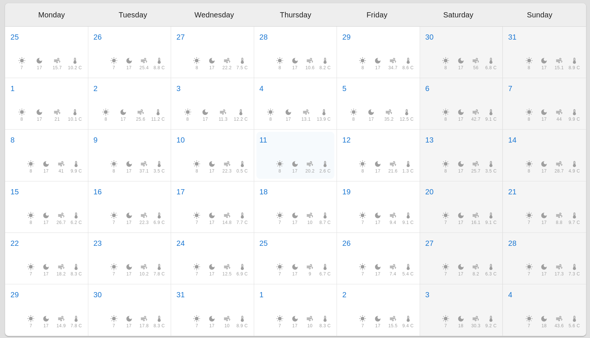

# What's it?

it's a project for understanding how to develop react interactive calendar without helped from Moment.js or date-fns.

And also to use:
- a forecast weather from [open-meteo](https://api.open-meteo.com/v1/)
- using a toolkit RTK Query from [redux-toolkit](https://redux-toolkit.js.org/rtk-query/usage/queries) as service for fetch forecast
- using light/dark themes for UI, from [MUI](https://mui.com/material-ui/customization/theming/)
- multi languages toolkit from [i18next](https://www.i18next.com/)

  

  

  

### [Here's what I've learned while develop an interactive calendar on ReactJs without helped  momentJs and date-fns.](./docs/learned.md)

# Technical stack

- TypeScript
- Eslint (airbnb)
- prettier
- react
- redux
- redux-toolkit
- i18next
- RTK Query
- MUI + styled-component + MUI icons
- MUI themes
- Vite instead of webpack and cra

# Project overview

## Components
- [Calendar](src/components/Calendar/Calendar.tsx) - it's component for render Calendar
- [Containers](src/components/Containers/style.ts) - it's styled-components for layouts

## Theme

- I use default theme from MUI, but i changed default borderRadius instead and created [defaultTheme](src/theme/index.ts) options.

## Features

- [ToggleThemeMode](src/features/ToggleThemeMode/ToggleThemeMode.tsx) - button for controlling theme mode 
- [ToggleMonth](src/features/ToggleMonth/ToggleMonth.tsx) - button for controlling calendar month
- [ButtonToday](src/features/ButtonToday/ButtonToday.tsx) - button for controlling calendar date

# Calendar tutorial

- [Stage 1: create base utils](./docs/tutorial.stage.1.md)
- [Stage 2: create base constants]()
- [Stage 3: create base calendar]()
- [Stage 4: control current date]()
- [Stage 5: create RTK service]()

# Sources
- [RTK Query](https://redux-toolkit.js.org/rtk-query/overview)
  - [Utilities](https://redux-toolkit.js.org/rtk-query/api/created-api/api-slice-utils)
  - [Cache Behavior](https://redux-toolkit.js.org/rtk-query/usage/cache-behavior)
- [react-i18next](https://react.i18next.com/getting-started)
- [new Date().getDay()](https://developer.mozilla.org/en-US/docs/Web/JavaScript/Reference/Global_Objects/Date/getDay)
- [mui dark/light theme](https://mui.com/material-ui/customization/dark-mode/)